# ACM AI School Workshop 1: Jupyter Notebook/Colab on the browser, NumPy Vectorization, MatplotLib

# Cool Stuff! - Stable Diffusion

https://acmurl.com/aischool1-stable-diffusion-demo


# Numpy


```python
import numpy as np
```

## What is Numpy?
Otherwise known as Numerical Python, a bunch of functins that helps us **do math** with Python.

Machine Learning takes into account a lot of *Linear Algebra*, as such, we can do math with matrices and vectors(which are crucial to ML)

*Question to think about*, as we'll get into furthur, how do you think Matrices work with Machine Learning?
Hint: Think about how different moving parts interact with each other, and how you would predict something based on past details.


```python

# Creating an array from a Python list
python_list = [1, 2, 3, 4, 5]
numpy_array = np.array(python_list)

# .array will be crucial for ML, mainly because you can create so many different types of inputs.
# Printing the NumPy array
print("NumPy array from Python list:")
print(numpy_array) # output: [1,2,3,4,5]


```

    NumPy array from Python list:
    [1 2 3 4 5]


### Creating arrays without Lists?

Numpy allows us to create arrays without having explicit lists. In the context of ML, most of our input is numeric, so we will mainly be generating matrices and arrays that have **numbers** inside them. These functions include:
- `np.zeros(dimensions)`
- `np.ones(dimensions)`
- `np.arange(start,end(exclusive),step)`

Let's see these in practice!


```python
# Creating arrays with np.ones, np.zeros, and np.arange
ones_array = np.ones((3, 3))  # 3x3 array of ones
zeros_array = np.zeros((2, 4))  # 2x4 array of zeros
range_array = np.arange(0, 10, 2)  # Array of even numbers from 0 to 8

print("\nArray of ones:")
print(ones_array)
print("\nArray of zeros:")
print(zeros_array)
print("\nArray using arange:")
print(range_array)
```

    
    Array of ones:
    [[1. 1. 1.]
     [1. 1. 1.]
     [1. 1. 1.]]
    
    Array of zeros:
    [[0. 0. 0. 0.]
     [0. 0. 0. 0.]]
    
    Array using arange:
    [0 2 4 6 8]


## Working with Matrices

As mentioned briefly, numpy allows to do *Linear Algebra* or math with what we call as matrices. 1-D matrices are similar to arrays, but are commonly referred to as *vectors*. Likewise, higher dimension arrays(similar to grids, cubes, or beyond that) are more explicitly known as matrices.


```python
# Example taking a vector and making it into a matrix
# Create a 1D array
arr_1d = np.array([1, 2, 3, 4, 5, 6])

# Reshape the 1D array into a 2x3 matrix
matrix_2x3 = arr_1d.reshape(2, 3)

print("1D Array:")
print(arr_1d)

print("\nReshaped into 2x3 Matrix:")
print(matrix_2x3)
```

    1D Array:
    [1 2 3 4 5 6]
    
    Reshaped into 2x3 Matrix:
    [[1 2 3]
     [4 5 6]]


## Reshape
We can transform matrices(if it makes sense) from a certain shape to another.
In the example above, we take a 1-D vector and make it into a 2x3 Grid. We can do these for any different type of matrix(if it makes sense to do so, i.e. the number of cells can be properly mapped to the new matrix).

For a non-square matrix


```python
# Create a 2x4 matrix
matrix_3x4 = np.array([[1, 2, 3, 4], [5, 6, 7, 8],[9,10,11,12]])

# Flatten the matrix into a 1D array
arr_flattened = matrix_3x4.flatten()

# Reshape the 1D array into a 4x3 matrix
matrix_4x3 = arr_flattened.reshape(4,3)

print("Original 2x4 Matrix:")
print(matrix_3x4)

print("\nFlattened to 1D Array:")
print(arr_flattened)

print("\nReshaped into 3x3 Matrix:")
print(matrix_4x3)
```

    Original 2x4 Matrix:
    [[ 1  2  3  4]
     [ 5  6  7  8]
     [ 9 10 11 12]]
    
    Flattened to 1D Array:
    [ 1  2  3  4  5  6  7  8  9 10 11 12]
    
    Reshaped into 3x3 Matrix:
    [[ 1  2  3]
     [ 4  5  6]
     [ 7  8  9]
     [10 11 12]]


## Flatten
We can `flatten` matrices into one dimension using the `flatten()` function. This *smushes* or compresses our entire matrix into 1-Dimension and allows us to do operations on them. This could be useful for looping/iterating through a certain type of input.  


## Higher Dimensions
Sometimes Machine Learning models might not be compatible with the crazy input that you are given: higher dimensions may not work for a given model so you can reshape it so that it makes more sense for your project.


```python
# Create a 3D array (2x3x2)
arr_3d = np.array([[[1, 2], [3, 4], [5, 6]], [[7, 8], [9, 10], [11, 12]]])

# Flatten the 3D array into a 1D array
arr_flattened_3d = arr_3d.flatten()

# Reshape the 1D array into a 2x6 matrix
matrix_2x6 = arr_flattened_3d.reshape(2, 6)

print("Original 3D Array:")
print(arr_3d)

print("\nFlattened to 1D Array:")
print(arr_flattened_3d)

print("\nReshaped into 2x6 Matrix:")
print(matrix_2x6)
```

    Original 3D Array:
    [[[ 1  2]
      [ 3  4]
      [ 5  6]]
    
     [[ 7  8]
      [ 9 10]
      [11 12]]]
    
    Flattened to 1D Array:
    [ 1  2  3  4  5  6  7  8  9 10 11 12]
    
    Reshaped into 2x6 Matrix:
    [[ 1  2  3  4  5  6]
     [ 7  8  9 10 11 12]]


# Furthur Exploration

If you're interested more into applications of Numpy(a bit more exhaustive):
Here's a link you can use!

[Numpy Article](https://medium.com/mlpoint/numpy-for-machine-learning-211a3e58b574)

# Matplotlib Tutorial

This tutorial is edited from this [Matplotlib Tutorial](https://colab.research.google.com/github/makeabilitylab/signals/blob/master/Tutorials/IntroToMatplotlib.ipynb#scrollTo=iKfLZhzX99el).

## Anatomy of a matplotlib chart


## The basics
[matplotlib.pyplot](https://matplotlib.org/api/pyplot_api.html#module-matplotlib.pyplot) provides a MATLAB-like plotting environment for Python. It's easy and fast to plot a range of visualizations. For example, let's plot the array `[1,2,3,4]`:


```python
import matplotlib.pyplot as plt
plt.plot([1,2,3,4])
plt.show()
```


    
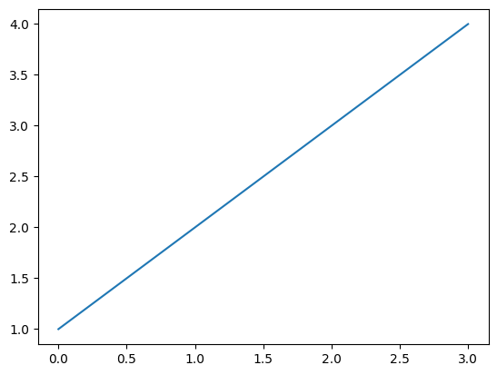
    


### Adding titles, axis labels, and a legend
Let's redraw this plot but now with a title, axis labels, and a legend:


```python
y_vals = [1,2,3,4]
plt.plot(y_vals, label="An awesome line")
plt.ylabel('The y-axis label!')
plt.xlabel('The x-axis label!')
plt.title("The title of the graph!")
plt.legend()
plt.show()
```


    
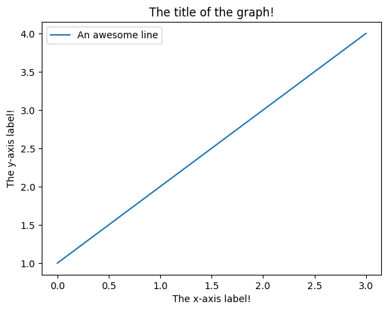
    


### Adding both x and y data

You may be wondering why the x-axis ranges from 0-3 and the y-axis from 1-4. If you provide a single list or array to the [plot()](https://matplotlib.org/api/pyplot_api.html#matplotlib.pyplot.plot) command, matplotlib assumes it is a sequence of y values, and automatically generates the x values for you.

[plot()](https://matplotlib.org/api/pyplot_api.html#matplotlib.pyplot.plot) is a versatile command, and will take an arbitrary number of arguments. For example, to plot x versus y, you can issue the command:


```python
x_vals = [1,2,3,4]
y_vals = [1, 4, 9, 16]
plt.plot(x_vals, y_vals)
plt.show()
```


    
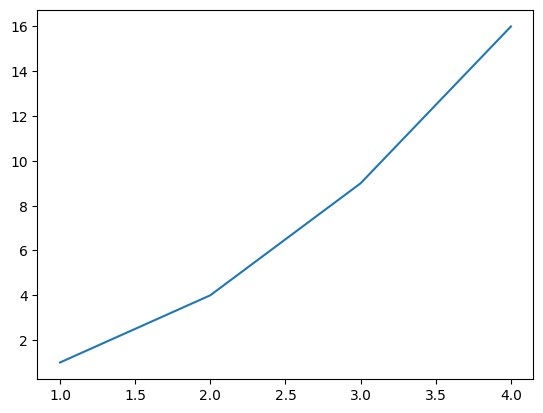
    


Here's another example using NumPy:


```python
import numpy as np
import matplotlib.pyplot as plt

# Compute the x and y coordinates for points on a sine curve
x = np.arange(0, 3 * np.pi, 0.1)
y = np.sin(x)

# Plot the points using matplotlib
plt.plot(x, y)
plt.show()  # You must call plt.show() to make graphics appear.
```


    
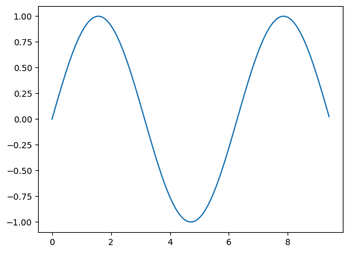
    


### Setting axis ranges
You can set the [xmin, xmax, ymin, ymax] of the plot using the [axis()](https://matplotlib.org/api/pyplot_api.html#matplotlib.pyplot.axis) command. So, for example:


```python
import matplotlib.pyplot as plt
plt.plot(x_vals, y_vals)
plt.axis([0, 6, 0, 20]) #x_min, x_max, y_min, y_max
plt.show()
```


    
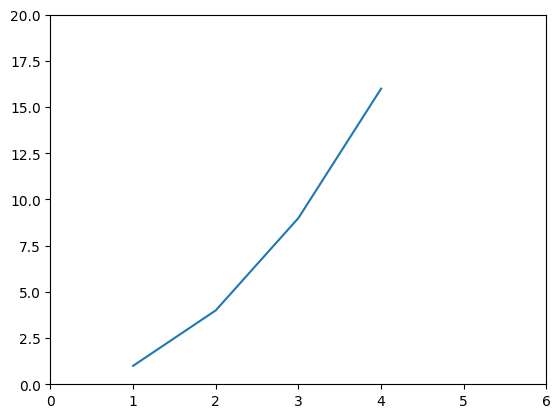
    


### Resizing the plot
We can also resize the plot using figsize. This will be important later when we make multiple plots together.


```python
import random

num_rand_data_points = 7
plt.figure(figsize=(10, 5)) # here we set the figure size to 10 x 5 (w x h)
x_vals = [random.randrange(1, 50, 1) for i in range(num_rand_data_points)]
plt.plot(x_vals, label="Random data")
plt.ylabel('The y-axis label!')
plt.xlabel('The x-axis label!')
plt.title("{} random data points!".format(num_rand_data_points))
plt.legend()
plt.show()
```


    
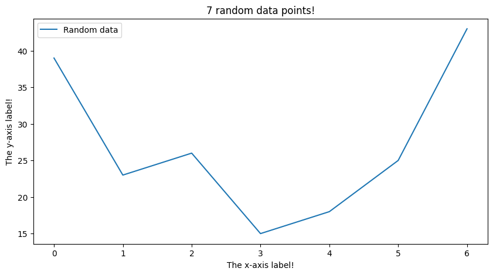
    


### Plotting multiple values
You can plot multiple lines too:


```python
# setup the data
(x1_vals, y1_vals) = ([1,2,3,4], [1, 4, 9, 16])
(x2_vals, y2_vals) = ([0,1,1.5,7], [1,4,12,16])
(x3_vals, y3_vals) = ([0,1,3,5], [3,4.5,7,18])

# plot the data
plt.figure(figsize=(10, 5))
plt.plot(x1_vals, y1_vals)
plt.plot(x2_vals, y2_vals)
plt.plot(x3_vals, y3_vals)
plt.show()
```


    
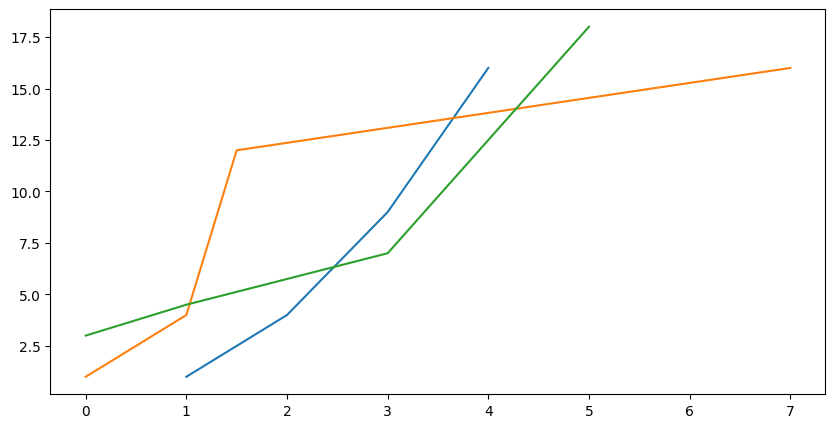
    


An even more compact way of doing this:


```python
plt.figure(figsize=(10, 5))
plt.plot(x1_vals, y1_vals, x2_vals, y2_vals, x3_vals, y3_vals)
plt.show()
```


    

    


And again with NumPy:


```python
import numpy as np
import matplotlib.pyplot as plt

# Compute the x and y coordinates for points on sine and cosine curves
x = np.arange(0, 3 * np.pi, 0.1)
y_sin = np.sin(x)
y_cos = np.cos(x)

# Plot the points using matplotlib
plt.plot(x, y_sin)
plt.plot(x, y_cos)
plt.xlabel('x axis label')
plt.ylabel('y axis label')
plt.title('Sine and Cosine')
plt.legend(['Sine', 'Cosine'])
plt.show()
```


    
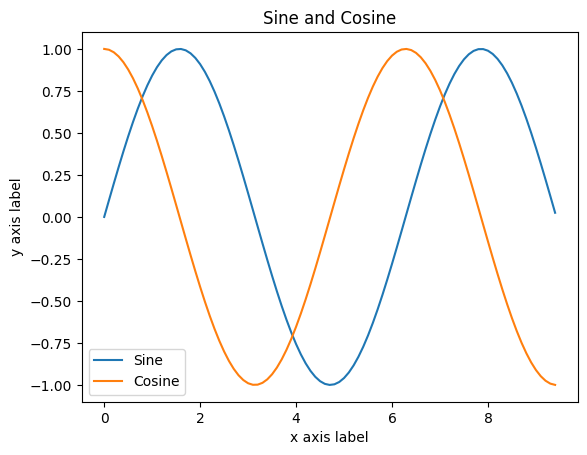
    


## Controlling Line Properties
- https://matplotlib.org/users/pyplot_tutorial.html#controlling-line-properties
- https://matplotlib.org/api/lines_api.html#matplotlib.lines.Line2D

Lines have many attributes that you can set: linewidth, dash style, marker, antialiasing, alpha, and more; see [matplotlib.lines.Line2D](https://matplotlib.org/api/lines_api.html#matplotlib.lines.Line2D). There are several ways to set line properties


```python
from matplotlib import pyplot as plt
import random
(x1_vals, y1_vals) = ([1,2,3,4], random.sample(range(0, 5), 4))
(x2_vals, y2_vals) = ([1,2,3,4], random.sample(range(0, 5), 4))
(x3_vals, y3_vals) = ([1,2,3,4], random.sample(range(0, 5), 4))

line1 = plt.plot(x1_vals, y1_vals)
line2 = plt.plot(x2_vals, y2_vals)
line3 = plt.plot(x3_vals, y3_vals)
plt.setp(line1, color='r', linewidth=2.0, marker='D', alpha=0.5)
plt.setp(line2, color='b', linewidth=2.0, marker='X', alpha=0.5)
plt.show()
```


    
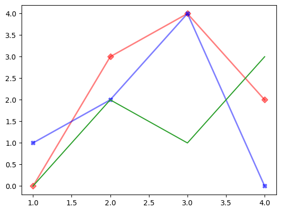
    


```python
lines = plt.plot(x1_vals, y1_vals, x2_vals, y2_vals, x3_vals, y3_vals)
plt.setp(lines[0], color='r', linewidth=2.0, marker='D', alpha=0.5)
plt.setp(lines[1], color='b', linewidth=2.0, marker='X', alpha=0.5)
plt.show()
```


    
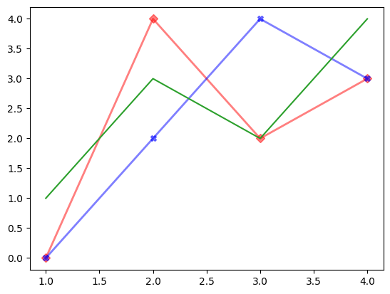
    


You can also set these properties using keyword args in the plot function:


```python
line1 = plt.plot(x1_vals, y1_vals, color='r', linewidth=2.0, marker='D', alpha=0.5)
line2 = plt.plot(x2_vals, y2_vals, color='b', linewidth=2.0, marker='X', alpha=0.5)
line3 = plt.plot(x3_vals, y3_vals)
plt.show()
```


    
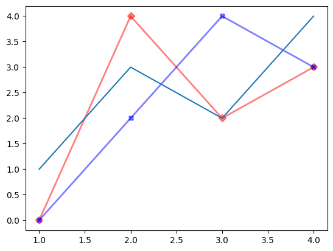
    


## Plotting multiple charts

You can create multiple plots within the same figure by using [`subplot`](https://matplotlib.org/gallery/subplots_axes_and_figures/subplot.html)

**References:**
- https://jakevdp.github.io/PythonDataScienceHandbook/04.08-multiple-subplots.html
- https://matplotlib.org/gallery/subplots_axes_and_figures/subplot.html
- https://matplotlib.org/devdocs/gallery/subplots_axes_and_figures/subplots_demo.html


```python
import numpy as np
import matplotlib.pyplot as plt

# subplot adds a subplot to the figure. To set the subplot location, pass
# in a three digit integer (< 10) where the first digit is the number of rows,
# the second the number of columns, and the third the index of the
# subplot. So, plt.subplot(211) refers to a two row plot with one
# column and selects the subplot index. This is equivalent to
# plt.subplot(2,1,1). See:
#   https://matplotlib.org/api/_as_gen/matplotlib.pyplot.subplot.html
plt.subplot(2,1,1) #nrows, ncols, index
plt.plot(x1_vals, y1_vals)

plt.subplot(2,1,2)
plt.plot(x2_vals, y2_vals, 'r-') # the 'r-' colors the line red
plt.show()
```


    
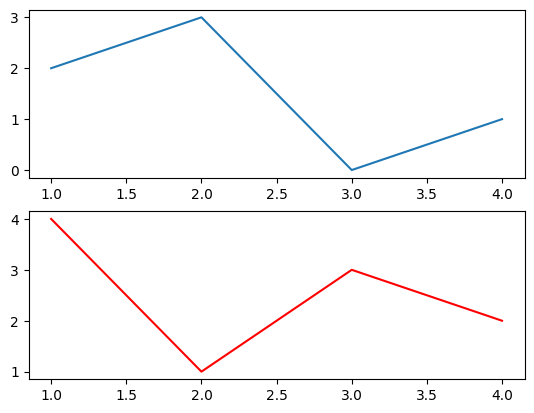
    


We can update a subplot easier by using

``` Python
fig, axes = plt.subplots(nrows, ncols)
```


```python
import matplotlib.pyplot as plt
# we can achieve this easier using fig, axs
fig, axes = plt.subplots(nrows=2, ncols=1)
axes[0].plot(x1_vals,y1_vals)
axes[1].plot(x2_vals,y2_vals, 'r-')
fig.show()
```


    

    


```python
# From: https://jakevdp.github.io/PythonDataScienceHandbook/04.08-multiple-subplots.html#plt.subplot:-Simple-Grids-of-Subplots
fig, axes = plt.subplots(nrows=2, ncols=3)
for row in range(2):
    for col in range(3):
      axes[row,col].text(0.5, 0.5, str((row,col)),
              fontsize=18, ha='center')
```


    
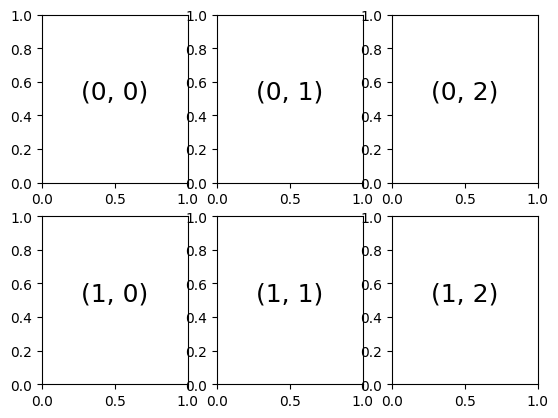
    


```python
fig, axes = plt.subplots(nrows=2, ncols=3)
fig.subplots_adjust(hspace=0.4, wspace=0.4) # here, we can adjust the spacing between the subplots by using hspace, wspace arguments.
for row in range(2):
    for col in range(3):
      axes[row,col].text(0.5, 0.5, str((row,col)),
              fontsize=18, ha='center')
```


    
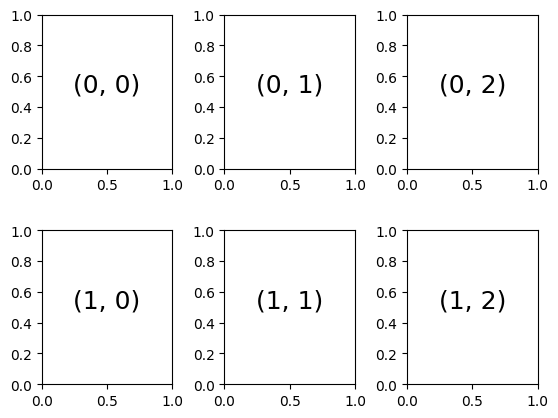
    


```python
# For example, let's add plot 1 into (0,2) and plot 2 into (1,0)

fig, axes = plt.subplots(nrows=2, ncols=3)
fig.subplots_adjust(hspace=0.4, wspace=0.4)

axes[0,2].plot(x1_vals,y1_vals)
axes[1,0].plot(x2_vals,y2_vals, 'r.')

fig.show()
```


    
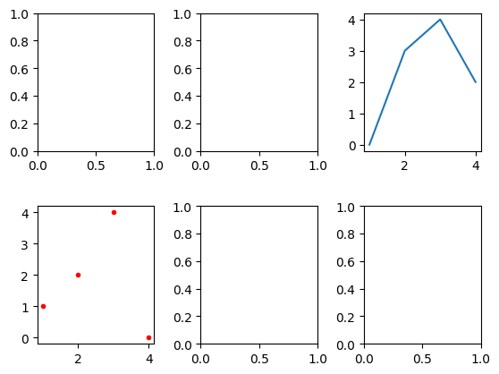
    


### Grid of Different Sizes: **Optional Reading**


```python
# Grid of different sizes
# See: https://matplotlib.org/users/gridspec.html
plt.figure(figsize=(20,10))
ax1 = plt.subplot2grid((3, 3), (0, 0), colspan=3)
ax2 = plt.subplot2grid((3, 3), (1, 0), colspan=2)
ax3 = plt.subplot2grid((3, 3), (1, 2), rowspan=2)
ax4 = plt.subplot2grid((3, 3), (2, 0))
ax5 = plt.subplot2grid((3, 3), (2, 1))
```


    
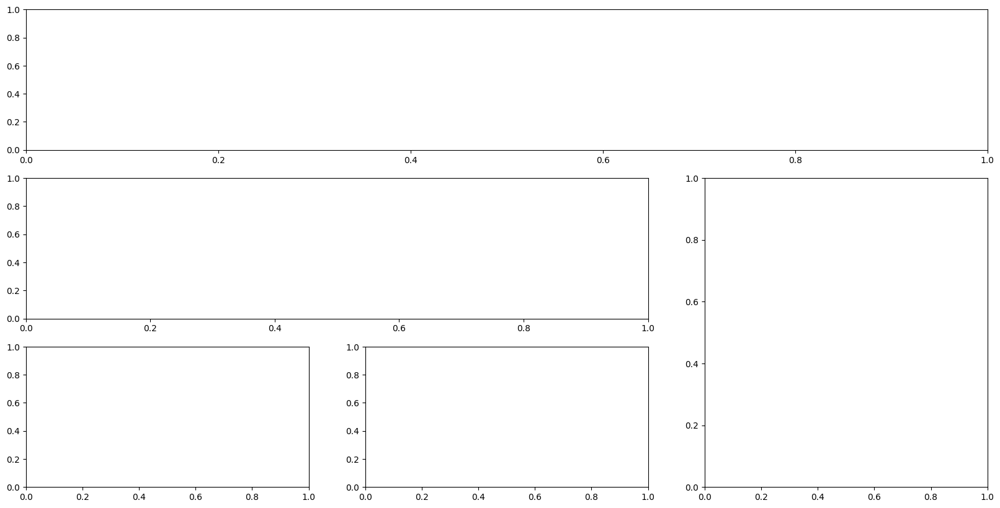
    


```python
# Grid of different sizes
# See: https://matplotlib.org/users/gridspec.html
plt.figure(figsize=(20,10))
ax1 = plt.subplot2grid((2, 2), (0, 0))
ax2 = plt.subplot2grid((2, 2), (0, 1))
ax3 = plt.subplot2grid((2, 2), (1, 0), colspan=2)


```


    
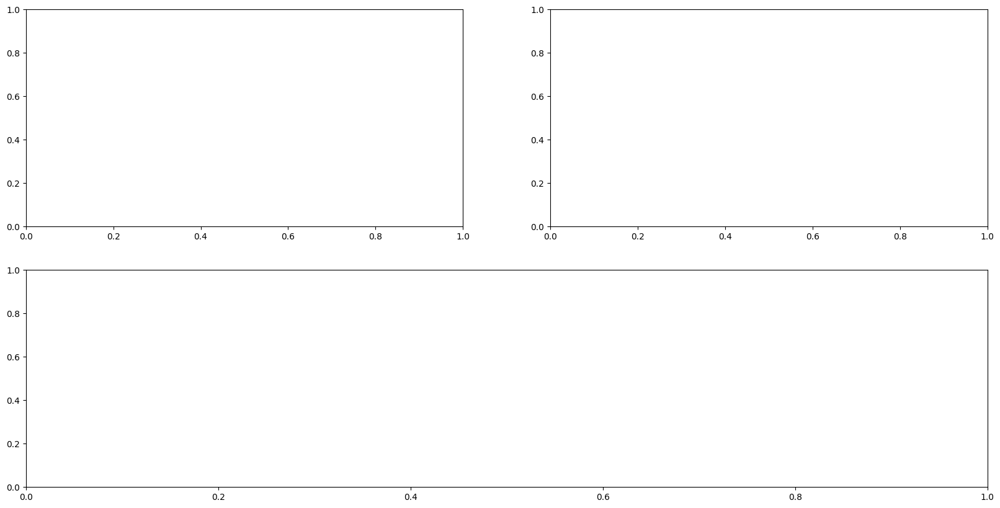
    


## Specifying Colors, Markers: **Optional Reading**

### Colors
- https://matplotlib.org/2.0.2/api/colors_api.html
- https://matplotlib.org/users/colors.html

In almost all places in matplotlib where a color can be specified by the user it can be provided as:

- an RGB or RGBA tuple of float values in [0, 1] (e.g., (0.1, 0.2, 0.5) or (0.1, 0.2, 0.5, 0.3))
- a hex RGB or RGBA string (e.g., '#0F0F0F' or '#0F0F0F0F')
- a string representation of a float value in [0, 1] inclusive for gray level (e.g., '0.5')
one of {'b', 'g', 'r', 'c', 'm', 'y', 'k', 'w'}
- a X11/CSS4 color name
- a name from the xkcd color survey prefixed with 'xkcd:' (e.g., 'xkcd:sky blue')
- one of {'C0', 'C1', 'C2', 'C3', 'C4', 'C5', 'C6', 'C7', 'C8', 'C9'}
- one of {'tab:blue', 'tab:orange', 'tab:green', 'tab:red', 'tab:purple', 'tab:brown', 'tab:pink', 'tab:gray', 'tab:olive', 'tab:cyan'} which are the Tableau Colors from the ‘T10’ categorical palette (which is the default color cycle).

For the basic built-in colors, you can use a single letter

- b: blue
- g: green
- r: red
- c: cyan
- m: magenta
- y: yellow
- k: black
- w: white

### Markers
- https://matplotlib.org/api/markers_api.html

There are lots of different markers, including:

- "." point
- "," pixel
- "o" circle
- "v" triangle_down
- "^" triangle_up
- "<" triangle_left
- ">" triangle_right
- "s" square
- "p" pentagon
- "P" plus (filled)
- "*" star
- "h" hexagon1
- "H" hexagon2
- "+" plus
- "x" x
- "X" x (filled)
- "D" diamond
- "d" thin_diamond


```python
import matplotlib.pyplot as plt
plt.plot([1,2,3,4], [1,4,9,16])
plt.plot([0,1,5,7], [1,4,9,16], 'D-')
plt.plot([0,1,3,5], [3,4.5,7,18], 'ro-')
plt.show()
```


    
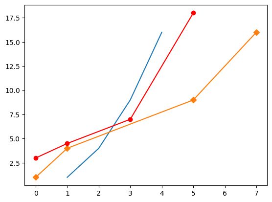
    


```python
# Example of all markers
# From: https://stackoverflow.com/a/46637880
import matplotlib.pylab as plt
markers=['.',',','o','v','^','<','>','1','2','3','4','8','s','p','P','*','h','H','+','x','X','D','d','|','_']
descriptions=['point', 'pixel', 'circle', 'triangle_down', 'triangle_up','triangle_left', 'triangle_right', 'tri_down', 'tri_up', 'tri_left','tri_right', 'octagon', 'square', 'pentagon', 'plus (filled)','star', 'hexagon1', 'hexagon2', 'plus', 'x', 'x (filled)','diamond', 'thin_diamond', 'vline', 'hline']
x=[]
y=[]
for i in range(5):
    for j in range(5):
        x.append(i)
        y.append(j)
plt.figure(figsize=(12,6))
for i,j,m,l in zip(x,y,markers,descriptions):
    plt.scatter(i,j,marker=m)
    plt.text(i-0.15,j+0.15,s=m+' : '+l)
plt.axis([-0.1,4.8,-0.1,4.5])
plt.tight_layout()
plt.axis('off')
plt.show()
```


    
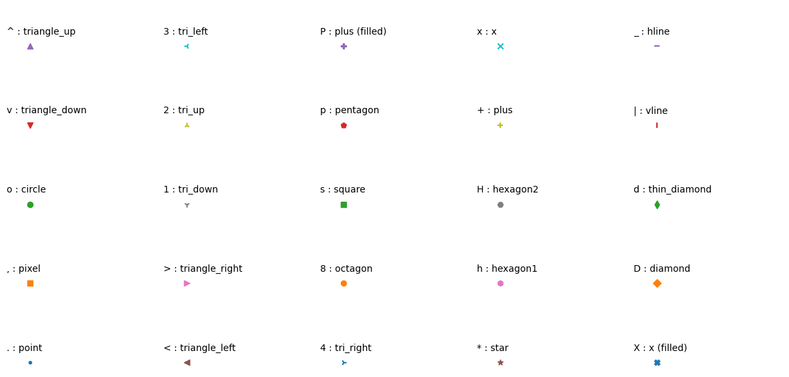
    


```python
import numpy as np
import matplotlib.pyplot as plt
markers = [(i,j,0) for i in range(2,10) for j in range(1, 3)]

[plt.plot(i, 0, marker = markers[i], ms=10) for i in range(16)]
```


    [[<matplotlib.lines.Line2D at 0x7f9924874a00>],
     [<matplotlib.lines.Line2D at 0x7f9924874d00>],
     [<matplotlib.lines.Line2D at 0x7f9924874fd0>],
     [<matplotlib.lines.Line2D at 0x7f99248752a0>],
     [<matplotlib.lines.Line2D at 0x7f9924875570>],
     [<matplotlib.lines.Line2D at 0x7f99248757e0>],
     [<matplotlib.lines.Line2D at 0x7f9924875ab0>],
     [<matplotlib.lines.Line2D at 0x7f9924875d80>],
     [<matplotlib.lines.Line2D at 0x7f9924876050>],
     [<matplotlib.lines.Line2D at 0x7f9924876320>],
     [<matplotlib.lines.Line2D at 0x7f99248765f0>],
     [<matplotlib.lines.Line2D at 0x7f9924876890>],
     [<matplotlib.lines.Line2D at 0x7f9924876b60>],
     [<matplotlib.lines.Line2D at 0x7f9924876e30>],
     [<matplotlib.lines.Line2D at 0x7f99248770a0>],
     [<matplotlib.lines.Line2D at 0x7f9924877280>]]


    
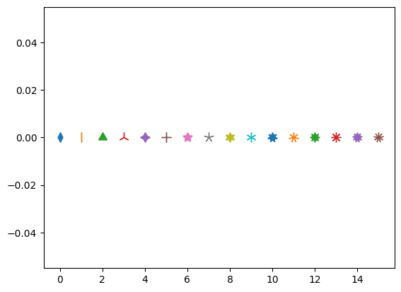
    


## Advanced Matplotlib Tutorial

*   If you want to know how to make different charts (Bar graph, histogram, pie charts, scatter plots, etc.), [Colab's Tutorial on Charts](https://colab.research.google.com/notebooks/charts.ipynb) can be a good resource.
*   For most cases, these techniques will be enough to make a good visulaization for your data. Otherwise, definitely look into these [examples](https://matplotlib.org/stable/gallery/index.html) from Matplotlib.


# NumPy Vectorization

## What is it❓
* Vectorization refers to using premade operation fuctions on entire arrays, matricies, or data of higher dimensions, rather than looping over them in python
* Numpy and Pytorch (Which we will get to soon🙂) have many premade vectorized operations for us
* The two types of vectorizations are 1.Indexing, 2. Element-wise operations
* These libraries make this simple by overloading common operator functions (+,-, etc.), and overloading the normal indexing function [ ] (overloading refers to repurposing functions to work differently on different inputs. Here, our inputs are Numpy arrays)
* There exists a vectorized function for almost any operation you can think of! (ex: +, -, *, /, ln, $e^x$, etc.)
* Pytorch's vectorization implementation is almost identical to Numpy's, so anything you learn here will transfer over!

#### Indexing Example:
* Flipping/Reversing an array - same as vanilla python!

    ```
    [::-1]
    ```


```python
import numpy as np
arr = np.arange(10)
flipped_arr = arr[::-1]
print('original array:\t', arr)
print('flipped array:\t', flipped_arr)
```

    original array:	 [0 1 2 3 4 5 6 7 8 9]
    flipped array:	 [9 8 7 6 5 4 3 2 1 0]


A General Formula for Slicing(For Flipping or any other processing in ML):
```
arr[lower:upper:step]
```

#### Operation Example:
* Element-wise array addition
    ```
    + operator
    ```


```python
arr1 = np.arange(10)
arr2 = np.arange(10)[::-1]
print('arr1: \t\t', arr1)
print('arr2: \t\t', arr2)
print('arr1 + arr2:\t', arr1 + arr2)
```

    arr1: 		 [0 1 2 3 4 5 6 7 8 9]
    arr2: 		 [9 8 7 6 5 4 3 2 1 0]
    arr1 + arr2:	 [9 9 9 9 9 9 9 9 9 9]


## What's the point❓
* As you may already know, Python is slow 🐢, and we don't want to slow down our Machine Learning 😞
* These prebuilt vectorized functions from Numpy and Pytorch are executed in C/C++ behind the scenes, making them super fast🏃❗
* When building a machine learning project, we always want to use vectorization over a python loop, when possible

#### More Examples of operations and indexing at the end of the section ⬇

#### Example
* Time-to-flip for an image: Loop🐢 vs Vectorization🏃


```python
##download cat image from the internet and store in cat.jpg - don't worry about wget; it's just a linux command for pulling data
!wget --output-document=cat.jpg https://t4.ftcdn.net/jpg/05/62/99/31/360_F_562993122_e7pGkeY8yMfXJcRmclsoIjtOoVDDgIlh.jpg -q

##read in the image - matplotlib.pyplot can read images from a file!
img = plt.imread('cat.jpg')

##show image and image dimensions
plt.imshow(img); plt.axis('off'); plt.show()
print(' image shape:', img.shape)
```


    

    


     image shape: (360, 540, 3)


```python
def flip_image_Loop(img):
  img = img.copy()
  #for each row
  for i in range(img.shape[0]):
    #for each pair of column pixels in each row, equal distance from the center
    for j in range(img.shape[1] // 2):
      ##for all channels Red, Green, and Blue.
      for k in range(img.shape[2]):
        ##swap the pixels - little python tuple trick used here to bypass using a temp var
        img[i,j,k], img[i,img.shape[1]-(j+1),k] = img[i,img.shape[1]-(j+1),k], img[i,j,k]
  return img
```


```python
def flip_image_Vectorized(img):
  img = img.copy()
  ##value ':' means 'all' for indexing
  ##this reads as the following:
  ##for all rows, flip all column pixels, for all channels Red, Green, and Blue
  return img[:, ::-1, :]
```


```python
##importing time to time the functions
import time

##helpful note - you can always time something by taking the time
##and subtracting it from a future time

#timing flipping via loop
curr_time = time.time()
img_loopflipped = flip_image_Loop(img)
loop_time = time.time() - curr_time

##timing flipping via vectorization
curr_time = time.time()
img_vectorflipped = flip_image_Vectorized(img)
vectorized_time = time.time() - curr_time
```


```python
##plot the flipped images, and print the timing of the functions!

##does this look familiar?
fig = plt.figure(figsize=(15,45))
ax = fig.add_subplot(1,3,1)
ax.imshow(img); ax.set_title('Original'); ax.axis('off')
ax = fig.add_subplot(1,3,2)
ax.imshow(img_loopflipped); ax.set_title('Loop-Flipped'); ax.axis('off')
ax = fig.add_subplot(1,3,3)
ax.imshow(img_vectorflipped); ax.set_title('Vector-Flipped'); ax.axis('off')
plt.show()

##print the times we measured, from the last jupyter cell
print(f' Loop-Flip latency: {loop_time:.5f} seconds')
print(f' Vector-Flip latency: {vectorized_time:.5f} seconds')
print(f' Vectorization was {(loop_time / vectorized_time):.2f}x faster than Looping!')
```


    

    


     Loop-Flip latency: 0.32843 seconds
     Vector-Flip latency: 0.00025 seconds
     Vectorization was 1329.67x faster than Looping!


## Tips for Learning Vectorization and Many Examples
* There are a lot of premade overloaded functions for Vectorization; I recommend opening your own colab notebook and practicing yourself!
* There are two main different types of Vectorization functions: Operations and Indexing
* Operations are relatively intuitive, however, indexing can seem a little complex at first, and it may take a while to understand how indexing interacts with high dimensional data - in computer vision, we commonly store images in small batches, which means we normally operate on 4 dimensional data! (images are 3D data themselves)
* ChatGPT can be an especially good teacher when trying to learn complex indexing by yourself!

### Comprehensive List of Vectorization Element-wise Operations:


```python
import numpy as np

# 1. Element-wise operations
a = np.array([1, 2, 3, 4])
b = np.array([5, 6, 7, 8])

# Addition
c = a + b
print("Addition:", c)  # Output: [6 8 10 12]

# Subtraction
c = a - b
print("Subtraction:", c)  # Output: [-4 -4 -4 -4]

# Multiplication
c = a * b
print("Multiplication:", c)  # Output: [ 5 12 21 32]

# Division
c = a / b
print("Division:", c)  # Output: [0.2, 0.33333333 0.42857143 0.5, ]

# Exponentiation
c = a ** b
print("Exponentiation:", c)  # Output: [1,64,2187,65536]

# 2. Scalar operations
a = np.array([1, 2, 3, 4])

# Addition
c = a + 5
print("Scalar Addition:", c)  # Output: [6 7 8 9]

# Subtraction
c = a - 2
print("Scalar Subtraction:", c)  # Output: [-1  0  1  2]

# Multiplication
c = a * 3
print("Scalar Multiplication:", c)  # Output: [ 3  6  9 12]

# Division
c = a / 2
print("Scalar Division:", c)  # Output: [0.5, 1., 1.5, 2.]

# Exponentiation
c = a ** 2
print("Scalar Exponentiation:", c)  # Output: [1, 4, 9, 16]

# 3. Mathematical functions
a = np.array([1, 2, 3, 4])

# Square root
c = np.sqrt(a)
print("Square Root:", c)  # Output: [1, 1.41421356, 1.73205081, 2.]

# Exponential function
c = np.exp(a)
print("Exponential:", c)  # Output: [ 2.71828183, 7.3890561, 20.08553692, 54.59815003]

# Logarithmic function
c = np.log(a)
print("Logarithm:", c)  # Output: [0., 0.69314718, 1.09861229, 1.38629436]

# Trigonometric functions
c = np.sin(a)
print("Sine:", c)  # Output: [0.84147098 0.90929743 0.14112001 -0.7568025]

# 4. Aggregation functions
a = np.array([1, 2, 3, 4])

# Summation
c = np.sum(a)
print("Sum:", c)  # Output: 10

# Minimum
c = np.min(a)
print("Minimum:", c)  # Output: 1

# Maximum
c = np.max(a)
print("Maximum:", c)  # Output: 4

# Mean
c = np.mean(a)
print("Mean:", c)  # Output: 2.5

# Standard deviation
c = np.std(a)
print("Standard Deviation:", c)  # Output: 1.118033988749895

# 5. Logical operations
a = np.array([True, False, True, False])
b = np.array([False, False, True, True])

# Logical AND
c = np.logical_and(a, b)
print("Logical AND:", c)  # Output: [False False  True False]

# Logical OR
c = np.logical_or(a, b)
print("Logical OR:", c)  # Output: [ True False  True  True]

# Logical NOT
c = np.logical_not(a)
print("Logical NOT:", c)  # Output: [False  True False  True]
```

    Addition: [ 6  8 10 12]
    Subtraction: [-4 -4 -4 -4]
    Multiplication: [ 5 12 21 32]
    Division: [0.2        0.33333333 0.42857143 0.5       ]
    Exponentiation: [    1    64  2187 65536]
    Scalar Addition: [6 7 8 9]
    Scalar Subtraction: [-1  0  1  2]
    Scalar Multiplication: [ 3  6  9 12]
    Scalar Division: [0.5 1.  1.5 2. ]
    Scalar Exponentiation: [ 1  4  9 16]
    Square Root: [1.         1.41421356 1.73205081 2.        ]
    Exponential: [ 2.71828183  7.3890561  20.08553692 54.59815003]
    Logarithm: [0.         0.69314718 1.09861229 1.38629436]
    Sine: [ 0.84147098  0.90929743  0.14112001 -0.7568025 ]
    Sum: 10
    Minimum: 1
    Maximum: 4
    Mean: 2.5
    Standard Deviation: 1.118033988749895
    Logical AND: [False False  True False]
    Logical OR: [ True False  True  True]
    Logical NOT: [False  True False  True]


### Common Vectorization Indexing Types:


```python
import numpy as np

# 1. Basic Indexing
a = np.array([1, 2, 3, 4, 5])

# Accessing a single element
print("Single Element:", a[2])  # Output: 3

# Slicing a portion of the array
print("Slicing:", a[1:4])  # Output: [2 3 4]

# Modifying elements using indexing
a[0] = 10
print("Modified Array:", a)  # Output: [10  2  3  4  5]

# 2. Multi-dimensional Indexing
b = np.array([[1, 2, 3], [4, 5, 6], [7, 8, 9]])

# Accessing a single element
print("Single Element:", b[1, 2])  # Output: 6

# Slicing rows and columns
print("Slicing Rows:", b[1:3, :])  # Output: [[4 5 6] [7 8 9]]
print("Slicing Columns:", b[:, 1:3])  # Output: [[2 3] [5 6] [8 9]]

# Modifying elements using indexing
b[0, 0] = 10
print("Modified Array:", b)
# Output: [[10  2  3]
#          [ 4  5  6]
#          [ 7  8  9]]

# 3. Boolean Indexing
c = np.array([1, 2, 3, 4, 5])

# Creating a boolean mask based on a condition
mask = c > 3
print("Boolean Mask:", mask)  # Output: [False False False  True  True]

# Applying the mask to retrieve elements satisfying the condition
filtered = c[mask]
print("Filtered Array:", filtered)  # Output: [4 5]

# Modifying elements using boolean indexing
c[c > 2] = 10
print("Modified Array:", c)  # Output: [ 1  2 10 10 10]

# 4. Fancy Indexing
d = np.array([1, 2, 3, 4, 5])

# Using an index array to retrieve specific elements
indices = np.array([0, 2, 4])
selected = d[indices]
print("Selected Elements:", selected)  # Output: [1 3 5]

# Modifying elements using fancy indexing
d[indices] = 10
print("Modified Array:", d)  # Output: [10  2 10  4 10]

```

    Single Element: 3
    Slicing: [2 3 4]
    Modified Array: [10  2  3  4  5]
    Single Element: 6
    Slicing Rows: [[4 5 6]
     [7 8 9]]
    Slicing Columns: [[2 3]
     [5 6]
     [8 9]]
    Modified Array: [[10  2  3]
     [ 4  5  6]
     [ 7  8  9]]
    Boolean Mask: [False False False  True  True]
    Filtered Array: [4 5]
    Modified Array: [ 1  2 10 10 10]
    Selected Elements: [1 3 5]
    Modified Array: [10  2 10  4 10]

